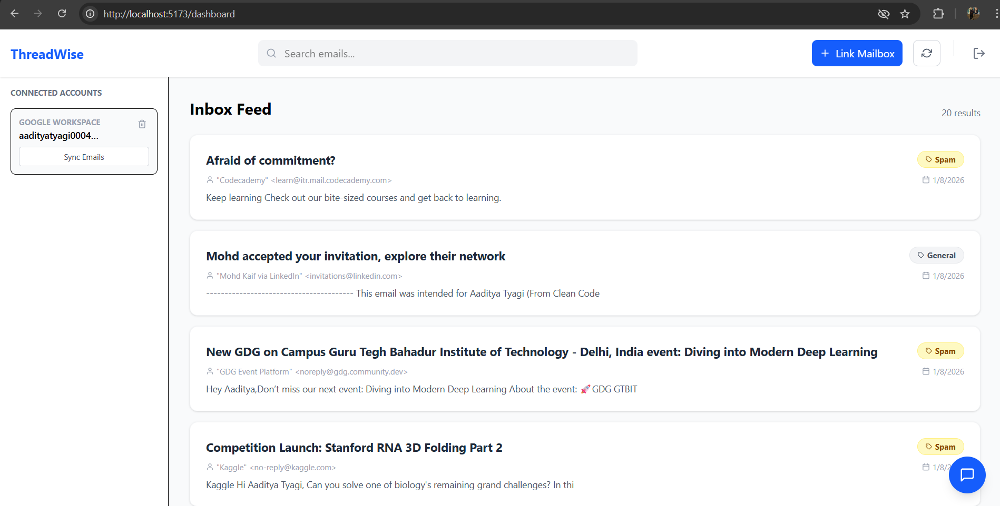
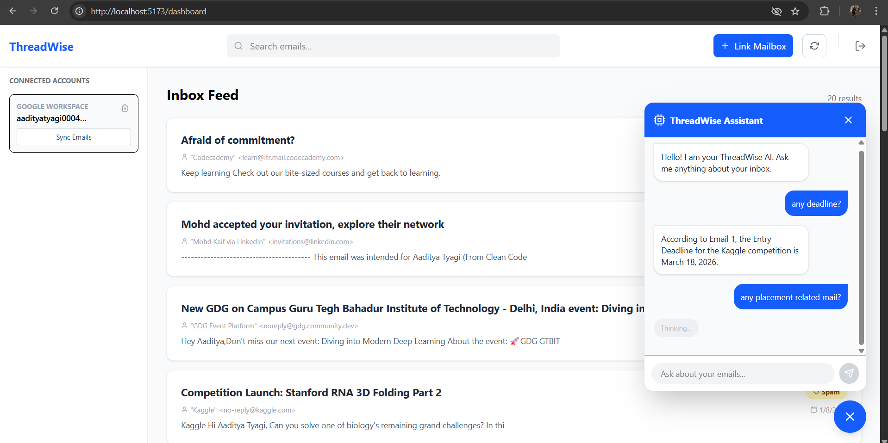
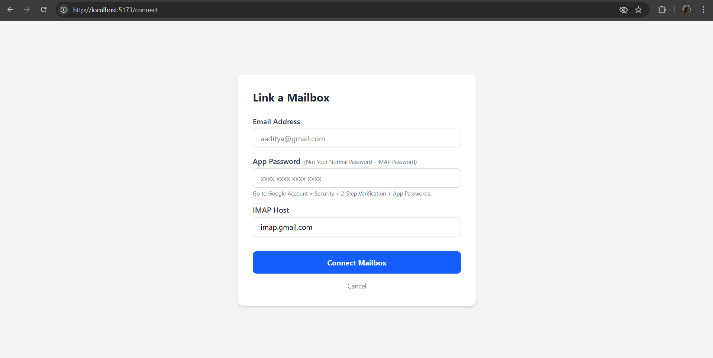
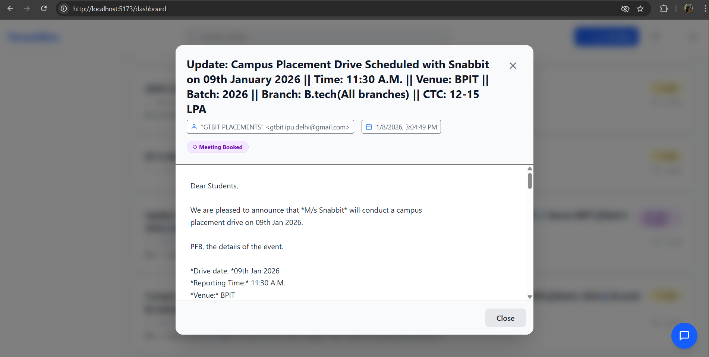
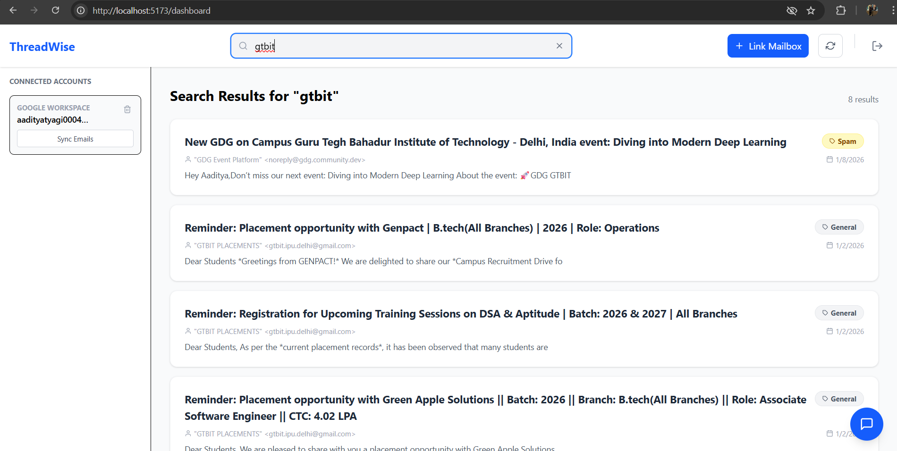
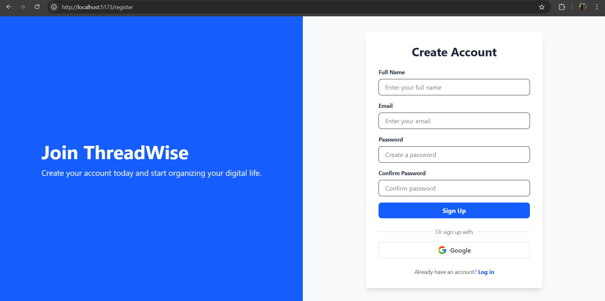
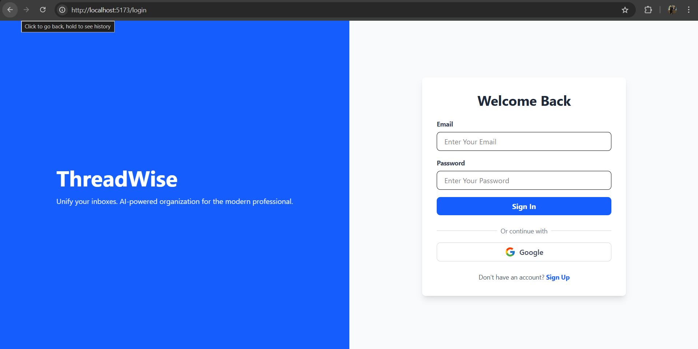

# 🧠 ThreadWise
### AI-Powered Intelligent Email Aggregator


> **ThreadWise** is a modern, full-stack email client that unifies your inboxes and uses **Local AI (LLMs)** to categorize, index, and understand your communications. Say goodbye to information overload.

---

## 📸 Screenshots

### 🧠 AI & Dashboard
| **Unified Inbox Feed** | **AI Chat Assistant (RAG)** |
|:---:|:---:|
|  |  |
| *Smart feed with auto-categorization* | *Ask questions to your inbox contextually* |

### ⚡ Smart Features
| **Secure Mailbox Connection** | **Email Details Modal** |
|:---:|:---:|
|  |  |
| *Securely link Gmail via App Passwords* | *Read full emails without leaving the feed* |

### 🔍 Search & Auth
| **Instant Search** | **User Registration** | **Secure Login** |
|:---:|:---:|:---:|
|  |  |  |
| *Find any email instantly with Elasticsearch* | *Secure Registration* | *Secure Login* | 

---

## 🚀 Why ThreadWise?
Modern email is broken. We have too many accounts and too much noise. ThreadWise solves this by:
1.  **Unifying Accounts:** Connect multiple Gmail accounts via secure IMAP.
2.  **Local Privacy:** Uses **Ollama** to run AI models locally on your machine—your data never leaves your specialized backend.
3.  **Instant Search:** Powered by **Elasticsearch** for sub-second retrieval of thousands of emails.
4.  **Smart Labeling:** Automatically tags emails as `Interested`, `Meeting Booked`, or `Spam` using Zero-Shot Classification.
5.  **Chat with Data:** Uses **RAG (Retrieval Augmented Generation)** so you can ask "Did I get any job offers?" and get an instant answer.

---

## 🛠️ Tech Stack

| Category | Technology | Description |
| :--- | :--- | :--- |
| **Frontend** |  | **Vite + React 19**. Fast, component-based UI. |
| **Styling** |  | **Tailwind v4**. Utility-first styling for a modern look. |
| **Backend** |  | **Express.js**. REST API handling auth and logic. |
| **Database** |  | **MongoDB Atlas**. Stores user profiles and encrypted credentials. |
| **Search Engine** |  | **Elasticsearch**. Indexed storage for full-text search. |
| **AI / LLM** |  | **Llama 3.2**. Local inference for email classification. |
| **Auth** |  | **Passport.js**. Secure Google Login & JWT Sessions. |

---

## ✨ Key Features

* **🔐 Secure Authentication:** Hybrid login system supporting standard Email/Password and **Google OAuth**.
* **📧 IMAP Sync Engine:** Securely connects to Gmail using App Passwords and fetches emails in real-time.
* **🧠 Chat with Inbox (RAG):** A floating AI assistant that answers questions based on your email context.
* **🤖 AI Categorization:** Inspects email content using **Llama 3.2** (via Ollama) to assign context-aware labels.
* **🔎 Full-Text Search:** Elasticsearch index allows for finding any email by keyword instantly.
* **🔔 Real-Time Alerts:** Webhook and Slack integrations notify you of "Interested" leads immediately.
* **📱 Responsive Dashboard:** A clean, split-screen UI built with React and Tailwind.

---

## ⚙️ Getting Started

Follow these steps to set up the project locally.

### Prerequisites
* **Node.js** (v18 or higher)
* **Docker Desktop** (For running Elasticsearch)
* **Ollama** (Installed locally for AI features)
* **MongoDB Atlas** account

---

### 1. Clone the Repository
```bash
git clone [https://github.com/yourusername/threadwise.git](https://github.com/yourusername/threadwise.git)
cd threadwise
```


### 2. Backend Setup

```bash
cd server
npm install
```

### Create a .env file in the server folder:

#### Code snippet
```bash
PORT=5000
MONGO_URI=your_mongodb_connection_string
JWT_SECRET=your_jwt_secret
ENCRYPTION_KEY=your_encryption_key
GOOGLE_CLIENT_ID=your_google_client_id
GOOGLE_CLIENT_SECRET=your_google_client_secret
SLACK_WEBHOOK_URL=your_slack_webhook (optional)
```

### Start the Backend:

```bash
npm run server
```

### 3. Frontend Setup

#### Open a new terminal.

```bash
cd threadwise
cd client
npm install
npm run dev
```

### 4. Infrastructure Setup
#### Start Elasticsearch (Docker):

```bash
docker run --name threadwise-es -d -p 9200:9200 -e "discovery.type=single-node" -e "xpack.security.enabled=false" docker.elastic.co/elasticsearch/elasticsearch:8.11.1
```
#### Start Local AI (Ollama):

#### ollama run llama3.2
**📖 Usage Guide**

* **Register:** Create an account or sign in with Google.

* **Connect:** Go to "Link Mailbox". Enter your Gmail address and App Password (Not your login password!).

* **Sync:** Click "Sync Emails" on the dashboard sidebar.

* **Wait:** The backend will fetch emails, send them to Ollama for tagging, and save them to Elasticsearch.

* **Search:** Use the top bar to filter emails instantly.


---


## 🔮 Roadmap

[x] User Authentication (JWT + OAuth)

[x] IMAP Integration

[x] Local AI Classification

[x] Full-Text Search

[x] Chat with Inbox (RAG)

[x] Account Management (Delete/Logout)

🤝 Contributing
Contributions are welcome! Please open an issue or submit a pull request.